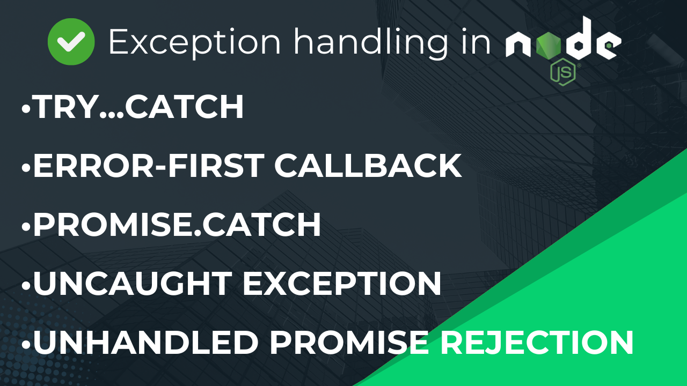

# How to handle Exception in NodeJS

[Watch video in Hindi/Urdu](https://youtu.be/2t9GWFiKj8o)

- [Try...Catch Blocks](./try-catch.js) Standard way of handling exceptions in JavaScript
- [Error-first Callback Pattern](./error-first-callback.js) Common in Node.js for asynchronous operations
- [Promise catch](./promise-catch.js) Used when working with promises
- [Async/await try...catch](./async-await-try-catch.js) Used with async/await syntax for asynchronous operations
- [Uncaught Exception Handling](./uncaughtException.js) Handles exceptions that are not caught anywhere in your code
- [Unhandled Promise Rejection Handling](./unhandledPromisRejectionHandeling.js) Handles promise rejections that are not caught
